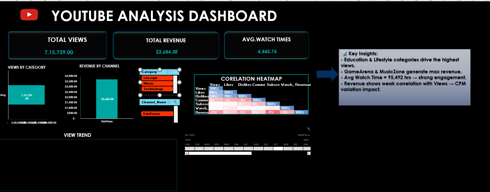

# 📊 YouTube Channel Performance Dashboard

## 🔹 Project Overview
This project analyzes YouTube channel performance using **Power BI** and **Excel**.  
It showcases how data can be used to track engagement, revenue, and audience behavior.  

## 🔹 Tools Used
- **Power BI Desktop** (Data modeling, DAX, Visualization)  
- **Excel** (Pivot charts, Dashboard design)  
- **AI (ChatGPT)** for step-by-step guidance  

## 🔹 Features
✅ KPIs: Total Views, Subscribers, Likes, Comments  
✅ Top 5 Videos by Views & Dislikes  
✅ Revenue Distribution by Category  
✅ Subscribers by Channel (Pie chart)  
✅ Interactive slicers & Tooltip (Power BI)  
✅ Same dashboard built in Excel for comparison  
✅ Insights box with business takeaways  

## 🔹 Dataset
- Mock dataset (20 YouTube videos across categories)  
- Columns: Video_ID, Channel_Name, Category, Upload_Date, Views, Likes, Dislikes, Comments, Subscribers_Gained, Watch_Time, Revenue  

## 🔹 Insights
- Gaming & Lifestyle categories drive maximum engagement.  
- TechWorld channel contributes the highest revenue share.  
- Video VID003 recorded peak views, while VID012 had lowest engagement.  
- Overall performance shows steady growth trend across months.  

## 🔹 Screenshots
📷 Power BI Dashboard  
  
📷 Excel Dashboard  
  

## 🔗 Connect with Me
📌 [LinkedIn Profile](https://www.linkedin.com/in/jyoti-kashyap-58a32336b)

---

✨ This project is part of my **Data Science journey** and portfolio.  
